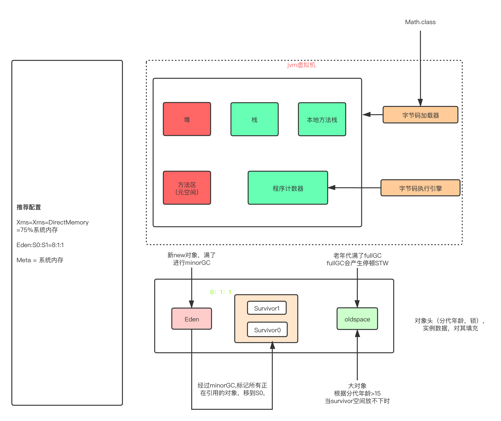

# Java 训练营第 0 期第一周

## 作业

###作业 1：自定义类加载器
* MyClassLoader.java（自定义类加载器）
* UseMyClassLoader.java（使用自定义类加载器加载 Hello.xlass 文件，并执行方法，简单验证）
* Hello 文件夹：存放需要加载的 class 文件

### 作业 2：绘制 jvm 内存结构图

### 作业 3：检查一下自己维护的业务系统的 JVM 参数配置
* 云服务器配置 2C4G
* jdk8_191
* -Xms1G
* -Xmx2G
* -XX:PermSize=256m
* -XX:MaxPermSize=512m

