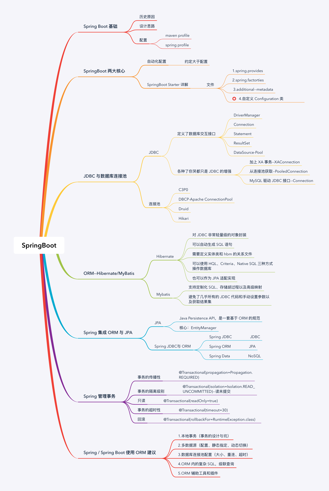

# 学习笔记

## 课堂学习笔记





## 作业

### Week05 作业题目（周四）：

1. （选做）使 Java 里的动态代理，实现一个简单的 AOP。
    
    状态：已完成
    代码地址：com.hujh.camping.week5.homework.myaop,执行 HumanFactory#main
    问题：希望拦截部分成功了，但是有点不符合期望，为什么代理生成的类不是 Student 类，执行方法的时候 Student 里面的方法没有被执行，日志如下
```
拦截方法成功，name=work
课前预习
拦截方法成功，name=work
课后复习
未拦截的方法，name = eat
未拦截的方法，name = sleep
验证结束
```
    
2. （必做）写代码实现 Spring Bean 的装配，方式越多越好（XML、Annotation 都可以）, 提交到 Github。

    状态：已完成
    
    代码地址：com.hujh.camping.week5.homework.myaop
    
    想到 3 种方式：1.使用 @Component 或者它派生的注解；2.Java 代码中显示注入@Bean；3.xml 文件中配置<bean>
    
3. （选做）实现一个 Spring XML 自定义配置，配置一组 Bean，例如：Student/Klass/School。

        状态：未完成
        
4. （选做，会添加到高手附加题）
    
    状态：未完成

    4.1 （挑战）讲网关的 frontend/backend/filter/router 线程池都改造成 Spring 配置方式；

    4.2 （挑战）基于 AOP 改造 Netty 网关，filter 和 router 使用 AOP 方式实现；

    4.3 （中级挑战）基于前述改造，将网关请求前后端分离，中级使用 JMS 传递消息；

    4.4 （中级挑战）尝试使用 ByteBuddy 实现一个简单的基于类的 AOP；

    4.5 （超级挑战）尝试使用 ByteBuddy 与 Instrument 实现一个简单 JavaAgent 实现无侵入下的 AOP。

### Week05 作业题目（周六）：
状态：未完成，本周内补


1. （选做）总结一下，单例的各种写法，比较它们的优劣。
2. （选做）maven/spring 的 profile 机制，都有什么用法？
3. （选做）总结 Hibernate 与 MyBatis 的各方面异同点。
4. （必做）给前面课程提供的 Student/Klass/School 实现自动配置和 Starter。
5. （选做）学习 MyBatis-generator 的用法和原理，学会自定义 TypeHandler 处理复杂类型。
6. （必做）研究一下 JDBC 接口和数据库连接池，掌握它们的设计和用法：

    6.1 使用 JDBC 原生接口，实现数据库的增删改查操作。
    
    6.2 使用事务，PrepareStatement 方式，批处理方式，改进上述操作。
    
    6.3 配置 Hikari 连接池，改进上述操作。提交代码到 Github。

### 附加题（可以后面上完数据库的课再考虑做）：

(挑战) 基于 AOP 和自定义注解，实现 @MyCache(60) 对于指定方法返回值缓存 60 秒。

(挑战) 自定义实现一个数据库连接池，并整合 Hibernate/Mybatis/Spring/SpringBoot。

(挑战) 基于 MyBatis 实现一个简单的分库分表 + 读写分离 + 分布式 ID 生成方案。